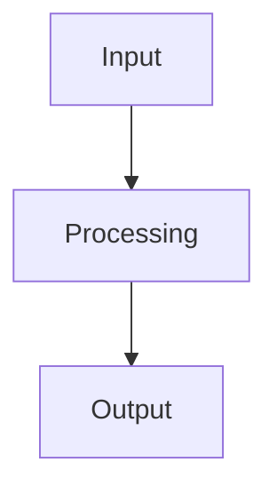
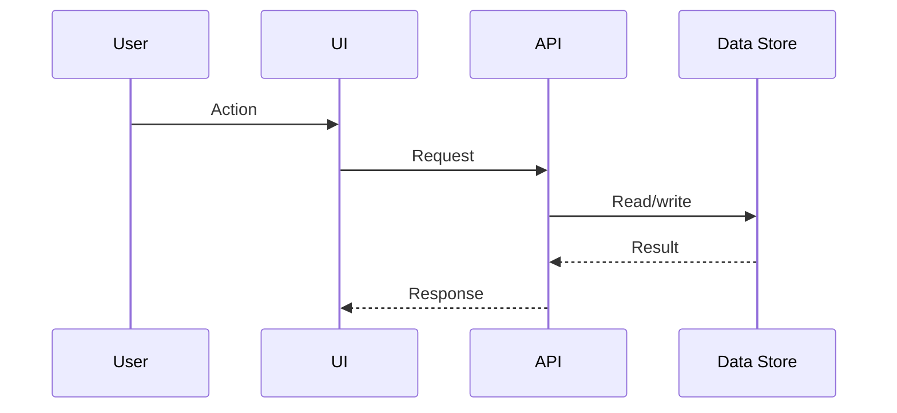

# Karpathy Codebase Knowledge Base Skill

Build and maintain a persistent, compounding, repo-local knowledge base for a TypeScript/Python codebase.

This skill adapts the Karpathy LLM Wiki pattern to software engineering. The goal is not just to summarize files. The goal is to compile code, tests, feature specs, decisions, and change history into a living knowledge base that an LLM agent can update incrementally as the repository evolves.

The human owns product direction, acceptance criteria, and correctness review. The agent owns mechanical extraction, wiki maintenance, cross-linking, consistency checks, stale-page detection, and update bookkeeping.

## Core Principles

1. **Source → raw → wiki → FS**
   - Source code is the ground truth.
   - `.kn/raw/` contains mechanical, reproducible facts extracted from source and git history.
   - `.kn/wiki/` contains human-readable high-level architecture and domain explanations.
   - `.kn/fs/` contains detailed feature specifications linked from wiki pages.

2. **Mechanical raw docs are not the wiki**
   - Raw docs may be large, repetitive, and tool-generated.
   - Wiki pages should be concise, synthesized, and useful for humans and agents.
   - Feature Specs may be detailed, but they must stay scoped to a feature or capability.

3. **Every claim should trace back**
   - Wiki and FS pages must cite code paths, test paths, raw files, commits, or source documents.
   - If the agent is unsure, mark the claim as `Needs Verification` instead of pretending.

4. **KB changes follow code changes**
   - On each meaningful commit or source update, refresh mechanical raw docs first.
   - Then update impacted wiki pages and feature specs.
   - Append all operations to `.kn/log.md`.

5. **Useful diagrams are allowed, not required**
   - Use Mermaid diagrams when they clarify dependency, flow, sequence, state, or lifecycle.
   - Do not generate decorative diagrams that do not improve understanding.

6. **Tests are first-class knowledge**
   - Unit, integration, and e2e tests should be indexed.
   - Test scenarios should link to feature specs and implementation modules.
   - Known gaps should be tracked.

7. **NFRs are first-class knowledge**
   - Performance, security, reliability, observability, scalability, accessibility, compatibility, privacy, and maintainability concerns must be tracked.
   - NFR pages should be updated when code, config, dependencies, infra, or test evidence changes.

---

# Repository Layout

Create a `.kn/` directory at the repository root.

```text
.kn/
  README.md
  SKILL.md                         # this skill prompt, copied into the repo
  config/
    kn.yaml                        # project-specific settings
    ignore.md                      # paths/patterns excluded from KB generation
  raw/
    codebase/
      snapshots/
      commits/
      modules/
      symbols/
      dependencies/
      APIs/
      configs/
      data-models/
      build-runtime/
      tests/
      e2e/
      nfr/
    external/
      docs/
      tickets/
      meetings/
      designs/
  wiki/
    index.md
    architecture/
    domain/
    frontend/
    backend/
    data/
    testing/
    operations/
    nfr/
    decisions/
  fs/
    index.md
    features/
    user-flows/
    integrations/
    data-flows/
  audits/
    open/
    closed/
  outputs/
    reports/
    diagrams/
    review-packets/
  scripts/
    scan-ts.mjs
    scan-py.py
    update-from-git.sh
    lint-kn.py
  log.md
```

## Directory Responsibilities

### `.kn/raw/`

Raw is for facts, not polished explanation.

Rules:

- Raw files can be regenerated.
- Raw files should be deterministic when possible.
- Do not manually beautify raw files.
- Include generation timestamp, command, commit SHA, and source path list.
- Raw files should preserve enough detail for later verification.

Typical raw artifacts:

```text
raw/codebase/modules/module-inventory.md
raw/codebase/symbols/symbol-index.jsonl
raw/codebase/dependencies/import-graph.mmd
raw/codebase/dependencies/package-dependency-report.md
raw/codebase/APIs/http-route-map.md
raw/codebase/APIs/openapi-detected-endpoints.md
raw/codebase/configs/env-config-inventory.md
raw/codebase/data-models/db-schema-map.md
raw/codebase/tests/unit-test-inventory.md
raw/codebase/e2e/e2e-scenario-map.md
raw/codebase/nfr/performance-hotspots.md
raw/codebase/nfr/security-surface.md
raw/codebase/commits/YYYY-MM-DD-<sha>-change-digest.md
```

### `.kn/wiki/`

Wiki is for durable understanding.

Rules:

- One concept per page.
- Prefer stable concepts over transient implementation details.
- Each page must link to related Feature Specs where applicable.
- Each page must contain a `Sources` section with code/raw/test references.
- Wiki pages should be readable by a new engineer joining the project.

Suggested wiki topics:

```text
wiki/index.md
wiki/architecture/system-overview.md
wiki/architecture/module-boundaries.md
wiki/architecture/dependency-map.md
wiki/domain/core-domain-model.md
wiki/frontend/frontend-architecture.md
wiki/backend/backend-architecture.md
wiki/data/data-model-overview.md
wiki/testing/testing-strategy.md
wiki/operations/build-and-runtime.md
wiki/nfr/performance.md
wiki/nfr/security.md
wiki/nfr/reliability.md
wiki/decisions/adr-index.md
```

### `.kn/fs/`

Feature Specs are detailed implementation documents.

Rules:

- FS pages live inside `.kn/fs/`, not mixed into `wiki/`.
- Wiki pages link to FS pages.
- FS pages link back to implementation modules, tests, e2e scenarios, APIs, data models, and NFR impacts.
- FS pages should be detailed enough to support future refactoring and test generation.

Suggested FS topics:

```text
fs/index.md
fs/features/<feature-slug>.md
fs/user-flows/<flow-slug>.md
fs/integrations/<integration-slug>.md
fs/data-flows/<data-flow-slug>.md
```

---

# File Templates

## Wiki Page Template

```md
---
title: <Page Title>
type: wiki
status: active
updated: YYYY-MM-DD
owners: []
confidence: high | medium | low
---

# <Page Title>

## What this page explains

Briefly explain the stable concept covered by this page.

## Summary

Concise synthesis. Avoid dumping raw file lists.

## Key Concepts

- Concept 1
- Concept 2
- Concept 3

## Architecture / Flow

Use prose first. Add Mermaid only if it clarifies.



## Important Code Paths

| Path | Role | Notes |
|---|---|---|
| `src/...` | ... | ... |

## Related Feature Specs

- [Feature Spec: ...](../../fs/features/<feature-slug>.md)

## Related Tests

- `tests/...`
- `e2e/...`

## NFR Notes

- Performance:
- Security:
- Reliability:
- Observability:

## Open Questions

- [ ] ...

## Sources

- Code: `src/...`
- Raw: `../../raw/codebase/...`
- Tests: `tests/...`
- Commits: `<sha>`
```

## Feature Spec Template

```md
---
title: <Feature Name>
type: feature-spec
status: draft | active | deprecated
updated: YYYY-MM-DD
feature_owner: unknown
confidence: high | medium | low
---

# Feature Spec: <Feature Name>

## 1. Background

Why this feature exists and what business/user problem it solves.

## 2. Goals

- Goal 1
- Goal 2

## 3. Non-goals

- Explicitly excluded scope

## 4. User Flow / System Flow



## 5. UX / UI Behavior

- Entry points:
- States:
- Validation:
- Error handling:

## 6. APIs / Interfaces

| Endpoint / Function | Request | Response | Notes |
|---|---|---|---|
| ... | ... | ... | ... |

## 7. Data Model

| Entity / Table / Type | Role | Important Fields |
|---|---|---|
| ... | ... | ... |

## 8. Algorithm / Business Rules

Describe the core logic in precise but readable terms.

## 9. Implementation Map

| Layer | Path | Responsibility |
|---|---|---|
| UI | `src/...` | ... |
| API | `src/...` | ... |
| Data | `src/...` | ... |

## 10. Tests

| Test | Path | Coverage | Gaps |
|---|---|---|---|
| Unit | `...` | ... | ... |
| Integration | `...` | ... | ... |
| E2E | `...` | ... | ... |

## 11. NFR Impact

- Performance:
- Security:
- Reliability:
- Observability:
- Accessibility:
- Compatibility:

## 12. Known Risks / Edge Cases

- Risk 1
- Risk 2

## 13. Open Questions

- [ ] ...

## 14. Sources

- Code: `src/...`
- Raw: `../../raw/codebase/...`
- Wiki: `../../wiki/...`
- Tests: `tests/...`
- Commits: `<sha>`
```

## Raw Commit Digest Template

```md
---
title: Commit Digest <sha>
type: raw-commit-digest
generated: YYYY-MM-DDTHH:mm:ssZ
commit: <sha>
base: <base-sha>
command: <command used>
---

# Commit Digest: <sha>

## Changed Files

| Path | Change Type | Notes |
|---|---|---|
| `src/...` | modified | ... |

## Mechanical Impact

- Modules affected:
- Symbols affected:
- Routes/APIs affected:
- Configs affected:
- Tests affected:
- NFR surface affected:

## Suggested KB Updates

| Target | Action | Reason |
|---|---|---|
| `wiki/...` | update | ... |
| `fs/...` | update | ... |

## Raw Diff Summary

Summarize behavior change without inventing intent.
```

---

# Initialization Workflow

When the user says something like:

- `init .kn`
- `initialize knowledge base`
- `create codebase KB`
- `setup Karpathy KB for this repo`

Do this:

1. Detect repository root.
2. Detect primary languages and frameworks.
3. Create `.kn/` directories if missing.
4. Create `.kn/config/kn.yaml` if missing.
5. Create `.kn/wiki/index.md`, `.kn/fs/index.md`, and `.kn/log.md` if missing.
6. Create starter scripts if the environment supports them.
7. Run the first mechanical scan if source files are available.
8. Compile the first wiki pages:
   - `wiki/architecture/system-overview.md`
   - `wiki/architecture/module-boundaries.md`
   - `wiki/testing/testing-strategy.md`
   - `wiki/nfr/nfr-overview.md`
9. Append an initialization entry to `.kn/log.md`.

Do not overwrite existing `.kn/` content unless the user explicitly asks.

## Starter `.kn/config/kn.yaml`

```yaml
project:
  name: auto-detect
  root: .
  primary_languages:
    - typescript
    - python

paths:
  include:
    - src
    - packages
    - apps
    - services
    - tests
    - e2e
  exclude:
    - node_modules
    - dist
    - build
    - coverage
    - .next
    - .turbo
    - .venv
    - __pycache__
    - .git

kb:
  root: .kn
  raw: .kn/raw
  wiki: .kn/wiki
  fs: .kn/fs
  audits: .kn/audits
  outputs: .kn/outputs

scan:
  typescript:
    enabled: true
    route_patterns:
      - "**/*route*.ts"
      - "**/*controller*.ts"
      - "**/*api*.ts"
    component_patterns:
      - "**/*.tsx"
      - "**/*.jsx"
      - "**/*.component.ts"
  python:
    enabled: true
    route_patterns:
      - "**/routes/**/*.py"
      - "**/views/**/*.py"
      - "**/api/**/*.py"
    model_patterns:
      - "**/models/**/*.py"
      - "**/schema*.py"

git:
  update_mode: incremental
  default_base: main

quality:
  require_sources: true
  require_test_links_for_fs: true
  stale_after_days: 30
```

---

# Mechanical Raw Generation

## TypeScript Scan

Use static analysis where possible. If a full AST parser is unavailable, use a conservative text scan and mark confidence accordingly.

Generate:

1. **Module inventory**
   - package/app/service boundaries
   - public exports
   - major directories
   - framework hints

2. **Symbol index**
   - exported classes, functions, types, interfaces
   - React/Angular components
   - hooks/services/controllers
   - file path and line range when available

3. **Import/dependency graph**
   - internal imports
   - external package imports
   - cycles if detected
   - Mermaid graph for high-level module dependencies

4. **API/route map**
   - Express/Fastify/Nest routes
   - Next.js route handlers
   - Angular route definitions
   - fetch/axios clients
   - RPC/event handlers where detected

5. **Config inventory**
   - `.env*` keys, without secret values
   - config files
   - feature flags
   - build scripts

6. **Test inventory**
   - unit/integration/e2e files
   - tested modules
   - scenario names
   - coverage hints if available

## Python Scan

Generate:

1. **Module inventory**
   - packages, modules, CLI entry points
   - framework hints: FastAPI, Flask, Django, Celery, SQLAlchemy, Pydantic, pytest

2. **Symbol index**
   - exported functions/classes
   - Pydantic models
   - SQLAlchemy/Django models
   - FastAPI/Flask/Django routes

3. **Dependency graph**
   - internal imports
   - external dependencies
   - cycles if detected

4. **API/route map**
   - decorators and route declarations
   - request/response models
   - middleware

5. **Data model map**
   - ORM models
   - migrations
   - schemas

6. **Test inventory**
   - pytest/unittest files
   - fixtures
   - e2e scripts

---

# Compile Workflow

When generating or updating wiki/FS pages:

1. Read the relevant raw artifacts first.
2. Inspect the source files that matter most.
3. Inspect related tests.
4. Determine whether the topic belongs in:
   - wiki only,
   - FS only,
   - both wiki and FS.
5. Update pages with explicit sources.
6. Update `wiki/index.md` and `fs/index.md`.
7. Append a log entry.

## Wiki vs FS Decision Rule

Use `wiki/` when the content answers:

- What is this subsystem?
- How are modules organized?
- What are the core concepts?
- How does data move through the system?
- What should a new engineer understand first?

Use `fs/` when the content answers:

- How does this specific feature work?
- What are the APIs, data models, algorithms, and edge cases?
- What tests prove this feature works?
- What should change when implementing or refactoring this feature?

Use both when a feature is important enough to affect architecture or domain understanding.

---

# Incremental Update From Git

When the user says:

- `kn update`
- `update KB from commit`
- `sync .kn with src`
- `refresh wiki after changes`
- `analyze this diff`

Do this:

1. Determine the base and head commit.
   - If not specified, compare working tree against `HEAD` or current branch against default branch.
2. Generate a raw commit digest under `.kn/raw/codebase/commits/`.
3. Refresh impacted raw mechanical docs only when possible.
4. Identify impacted wiki pages and FS pages.
5. Update those pages.
6. Mark unrelated stale pages only if evidence suggests drift.
7. Update indexes.
8. Append to `.kn/log.md`.

## Impact Classification

Classify each changed file:

| Change Area | Examples | KB Targets |
|---|---|---|
| UI | components, routes, state, forms | `wiki/frontend/`, `fs/features/`, e2e map |
| API | controllers, routes, services | `wiki/backend/`, `fs/integrations/`, API raw map |
| Data | models, migrations, SQL, schemas | `wiki/data/`, FS data model section |
| Config | env, build, deploy, flags | `wiki/operations/`, NFR pages |
| Tests | unit/integration/e2e | `wiki/testing/`, FS test section |
| Dependencies | package files, lockfiles | `wiki/operations/`, security/performance NFR |
| Docs | README, ADR, ticket | relevant wiki/FS/decision page |

---

# NFR Tracking

Maintain `.kn/wiki/nfr/` and raw NFR reports.

Minimum NFR pages:

```text
wiki/nfr/nfr-overview.md
wiki/nfr/performance.md
wiki/nfr/security.md
wiki/nfr/reliability.md
wiki/nfr/observability.md
wiki/nfr/maintainability.md
```

For each NFR page, track:

- Current evidence from code/config/tests.
- Known risks.
- Monitoring/logging hooks.
- Scalability constraints.
- Security-sensitive paths.
- Test coverage.
- Recent commits that changed the NFR surface.

NFR raw sources may include:

```text
raw/codebase/nfr/security-surface.md
raw/codebase/nfr/performance-hotspots.md
raw/codebase/nfr/dependency-risk-report.md
raw/codebase/nfr/observability-inventory.md
raw/codebase/nfr/runtime-config-risk.md
```

Never claim an NFR is satisfied unless there is evidence from tests, monitoring, config, code, benchmark, or production documentation.

---

# Tests and E2E Knowledge

Tests must be represented in the KB.

Generate:

```text
raw/codebase/tests/unit-test-inventory.md
raw/codebase/tests/integration-test-inventory.md
raw/codebase/e2e/e2e-scenario-map.md
wiki/testing/testing-strategy.md
wiki/testing/e2e-coverage-map.md
```

For each important feature spec, include:

- Related unit tests.
- Related integration tests.
- Related e2e tests.
- Untested edge cases.
- Suggested missing tests.

E2E scenario pages should track:

```md
# E2E Scenario: <Name>

## User Journey

## Preconditions

## Mock / Fixture Dependencies

## Steps

## Assertions

## Related Feature Specs

## Related Source Paths

## Known Flakiness / Gaps
```

---

# Mermaid Diagram Rules

Use Mermaid when it helps explain:

- module dependency graph
- request lifecycle
- feature flow
- state machine
- data lineage
- background job sequence
- deployment/runtime topology

Prefer these diagram types:

```text
flowchart TD
sequenceDiagram
stateDiagram-v2
erDiagram
classDiagram
```

Rules:

- Keep diagrams small enough to read.
- If the raw graph is too large, generate a high-level graph in wiki and keep full graph under raw.
- Do not use diagrams as a replacement for prose.
- Link diagrams back to raw graph sources.

---

# Query Workflow

When the user asks a question about the codebase:

1. Search `.kn/wiki/` and `.kn/fs/` first.
2. If the answer may be stale or incomplete, inspect `.kn/raw/`.
3. If needed, inspect source code and tests directly.
4. Answer with citations to wiki, FS, raw, code paths, and commits.
5. If the answer reveals missing or stale KB content, update the relevant KB pages if the user asked for maintenance; otherwise mention the gap.

Answer format:

```md
## Answer

<Direct answer>

## Evidence

- `wiki/...`
- `fs/...`
- `raw/...`
- `src/...`

## Notes / Gaps

- ...
```

---

# Audit and Feedback Workflow

When the user corrects the KB or says the wiki is wrong:

1. Capture the correction in `.kn/audits/open/YYYY-MM-DD-<slug>.md`.
2. Locate the affected wiki/FS/raw pages.
3. Verify against source if possible.
4. Update the wiki/FS page.
5. Move the audit note to `.kn/audits/closed/`.
6. Append to `.kn/log.md`.

Audit note template:

```md
---
title: <Correction Title>
status: open | closed
created: YYYY-MM-DD
closed: null
severity: low | medium | high
---

# <Correction Title>

## User Feedback

## Affected Pages

## Verification

## Resolution
```

---

# Lint Workflow

When the user says:

- `lint .kn`
- `check KB quality`
- `find stale pages`
- `audit links`

Run these checks:

1. Index consistency
   - Every wiki page appears in `wiki/index.md`.
   - Every FS page appears in `fs/index.md`.

2. Link consistency
   - Internal links resolve.
   - Wiki ↔ FS links are reciprocal where appropriate.
   - Raw references exist.

3. Source coverage
   - Every wiki/FS page has sources.
   - Pages without code/raw/test references are marked.

4. Staleness
   - Compare page `updated` dates to relevant source file commit dates.
   - Mark pages stale if source changed after page update.

5. Test coverage linkage
   - Important FS pages should have test links or explicitly state missing tests.

6. NFR linkage
   - Important FS pages should include NFR impact.

7. Mermaid validity
   - Mermaid blocks should be syntactically plausible.

Output:

```text
.kn/outputs/reports/YYYY-MM-DD-lint-report.md
```

---

# Suggested Local Commands

These are examples. Adapt them to the actual repo and toolchain.

## Initialize

```bash
mkdir -p .kn/{config,raw/codebase,wiki,fs,audits/open,audits/closed,outputs/reports,outputs/diagrams,scripts}
```

## Update From Git

```bash
bash .kn/scripts/update-from-git.sh main HEAD
```

## TypeScript Scan

```bash
node .kn/scripts/scan-ts.mjs --root . --out .kn/raw/codebase
```

## Python Scan

```bash
python3 .kn/scripts/scan-py.py --root . --out .kn/raw/codebase
```

## Lint

```bash
python3 .kn/scripts/lint-kn.py .kn
```

---

# Minimal `update-from-git.sh`

```bash
#!/usr/bin/env bash
set -euo pipefail

BASE="${1:-HEAD~1}"
HEAD="${2:-HEAD}"
DATE="$(date -u +%Y-%m-%d)"
SHA="$(git rev-parse --short "$HEAD")"
OUT=".kn/raw/codebase/commits/${DATE}-${SHA}-change-digest.md"

mkdir -p .kn/raw/codebase/commits

{
  echo "---"
  echo "title: Commit Digest ${SHA}"
  echo "type: raw-commit-digest"
  echo "generated: $(date -u +%Y-%m-%dT%H:%M:%SZ)"
  echo "commit: $(git rev-parse "$HEAD")"
  echo "base: $(git rev-parse "$BASE")"
  echo "command: git diff --name-status ${BASE} ${HEAD}"
  echo "---"
  echo
  echo "# Commit Digest: ${SHA}"
  echo
  echo "## Changed Files"
  echo
  echo "| Status | Path |"
  echo "|---|---|"
  git diff --name-status "$BASE" "$HEAD" | awk '{print "| `"$1"` | `"$2"` |"}'
  echo
  echo "## Diff Summary"
  echo
  git diff --stat "$BASE" "$HEAD"
  echo
  echo "## Suggested KB Review"
  echo
  echo "- [ ] Refresh mechanical raw docs for impacted areas."
  echo "- [ ] Update affected wiki pages."
  echo "- [ ] Update affected feature specs."
  echo "- [ ] Update test/e2e inventory if tests changed."
  echo "- [ ] Update NFR pages if config, dependencies, runtime, performance, security, or reliability changed."
} > "$OUT"

echo "Wrote $OUT"
```

---

# Minimal TypeScript Scanner Skeleton

```js
#!/usr/bin/env node
import fs from 'node:fs';
import path from 'node:path';

const rootArgIndex = process.argv.indexOf('--root');
const outArgIndex = process.argv.indexOf('--out');
const root = rootArgIndex >= 0 ? process.argv[rootArgIndex + 1] : '.';
const out = outArgIndex >= 0 ? process.argv[outArgIndex + 1] : '.kn/raw/codebase';

const includeExt = new Set(['.ts', '.tsx', '.js', '.jsx']);
const ignore = ['node_modules', 'dist', 'build', 'coverage', '.git', '.kn'];

function walk(dir, files = []) {
  for (const entry of fs.readdirSync(dir, { withFileTypes: true })) {
    if (ignore.includes(entry.name)) continue;
    const full = path.join(dir, entry.name);
    if (entry.isDirectory()) walk(full, files);
    else if (includeExt.has(path.extname(entry.name))) files.push(full);
  }
  return files;
}

function rel(p) {
  return path.relative(root, p).replaceAll('\\\\', '/');
}

const files = walk(root);
fs.mkdirSync(path.join(out, 'modules'), { recursive: true });
fs.mkdirSync(path.join(out, 'symbols'), { recursive: true });
fs.mkdirSync(path.join(out, 'dependencies'), { recursive: true });

const moduleInventory = [];
const symbolLines = [];
const depEdges = [];

for (const file of files) {
  const text = fs.readFileSync(file, 'utf8');
  const r = rel(file);
  moduleInventory.push(`| \`${r}\` | ${text.split('\n').length} |`);

  for (const m of text.matchAll(/export\s+(class|function|interface|type|const)\s+([A-Za-z0-9_]+)/g)) {
    symbolLines.push(JSON.stringify({ file: r, kind: m[1], name: m[2], confidence: 'medium' }));
  }

  for (const m of text.matchAll(/import\s+.*?from\s+['"]([^'"]+)['"]/g)) {
    depEdges.push({ from: r, to: m[1] });
  }
}

fs.writeFileSync(
  path.join(out, 'modules/module-inventory.md'),
  `# Module Inventory\n\nGenerated: ${new Date().toISOString()}\n\n| File | Lines |\n|---|---:|\n${moduleInventory.join('\n')}\n`
);

fs.writeFileSync(
  path.join(out, 'symbols/symbol-index.jsonl'),
  symbolLines.join('\n') + '\n'
);

fs.writeFileSync(
  path.join(out, 'dependencies/import-edges.json'),
  JSON.stringify(depEdges, null, 2)
);

console.log(`Scanned ${files.length} TS/JS files into ${out}`);
```

---

# Minimal Python Scanner Skeleton

```py
#!/usr/bin/env python3
import ast
import json
import os
from pathlib import Path

root = Path('.')
out = Path('.kn/raw/codebase')
ignore = {'.git', '.kn', '.venv', '__pycache__', 'dist', 'build'}

for i, arg in enumerate(os.sys.argv):
    if arg == '--root' and i + 1 < len(os.sys.argv):
        root = Path(os.sys.argv[i + 1])
    if arg == '--out' and i + 1 < len(os.sys.argv):
        out = Path(os.sys.argv[i + 1])

files = []
for p in root.rglob('*.py'):
    if any(part in ignore for part in p.parts):
        continue
    files.append(p)

(out / 'modules').mkdir(parents=True, exist_ok=True)
(out / 'symbols').mkdir(parents=True, exist_ok=True)
(out / 'dependencies').mkdir(parents=True, exist_ok=True)

module_rows = []
symbols = []
imports = []

for p in files:
    rel = p.relative_to(root).as_posix()
    text = p.read_text(encoding='utf-8', errors='ignore')
    module_rows.append(f"| `{rel}` | {len(text.splitlines())} |")
    try:
        tree = ast.parse(text)
    except SyntaxError:
        continue

    for node in ast.walk(tree):
        if isinstance(node, (ast.FunctionDef, ast.AsyncFunctionDef, ast.ClassDef)):
            symbols.append({
                'file': rel,
                'kind': type(node).__name__,
                'name': node.name,
                'line': getattr(node, 'lineno', None),
                'confidence': 'high',
            })
        elif isinstance(node, ast.Import):
            for name in node.names:
                imports.append({'from': rel, 'to': name.name})
        elif isinstance(node, ast.ImportFrom):
            imports.append({'from': rel, 'to': node.module})

(out / 'modules/module-inventory.md').write_text(
    '# Module Inventory\n\n| File | Lines |\n|---|---:|\n' + '\n'.join(module_rows) + '\n',
    encoding='utf-8',
)

(out / 'symbols/symbol-index.jsonl').write_text(
    '\n'.join(json.dumps(s, ensure_ascii=False) for s in symbols) + '\n',
    encoding='utf-8',
)

(out / 'dependencies/import-edges.json').write_text(
    json.dumps(imports, indent=2, ensure_ascii=False),
    encoding='utf-8',
)

print(f'Scanned {len(files)} Python files into {out}')
```

---

# Log Format

Append to `.kn/log.md` for every operation.

```md
## YYYY-MM-DD HH:mm UTC — <operation>

- Trigger: <user request / command>
- Scope: <paths / commits / topics>
- Raw updated:
  - `.kn/raw/...`
- Wiki updated:
  - `.kn/wiki/...`
- FS updated:
  - `.kn/fs/...`
- Notes:
  - ...
```

---

# Agent Behavior Rules

## Always Do

- Prefer exact code references over vague descriptions.
- Keep high-level wiki pages short and useful.
- Put detailed feature mechanics in FS pages.
- Regenerate raw before rewriting wiki when source changed.
- Mark uncertainty explicitly.
- Preserve user decisions as design/decision notes.
- Maintain links between wiki, FS, tests, and raw.
- Track NFR impact when code/config/dependencies change.

## Never Do

- Do not treat raw generated docs as authoritative if source code contradicts them.
- Do not invent features, APIs, or tests.
- Do not overwrite existing KB pages without preserving useful content.
- Do not store secrets from `.env` files; only store key names and usage context.
- Do not generate massive unreadable diagrams in wiki pages.
- Do not let FS pages become random notes; keep each FS scoped.

## When Unsure

Use these labels:

```text
Confidence: high      # directly verified in code/tests/raw
Confidence: medium    # inferred from multiple signals
Confidence: low       # plausible but not fully verified
Needs Verification    # user or code owner should confirm
```

---

# Recommended First Run

After installing this skill into a repository, ask the agent:

```text
Initialize .kn for this TypeScript/Python repo. Generate mechanical raw docs, then create the first wiki overview, module-boundary page, testing strategy page, NFR overview, and FS index. Do not overwrite existing files.
```

Then run:

```text
Update .kn from the latest git diff and tell me which wiki and FS pages changed.
```

---

# Prior Art Adapted

This skill borrows the broad pattern, not verbatim content, from:

- Andrej Karpathy's LLM Wiki idea: persistent, compounding Markdown wiki maintained by an LLM.
- Astro-Han's agent-skill structure using raw source material and compiled wiki pages.
- lewislulu's workflow ideas around compile/query/lint/audit and feedback loops.
- compozy/kb's repo-local CLI/codebase-ingestion direction, especially the idea that mechanical scanning and LLM synthesis should be separate layers.

