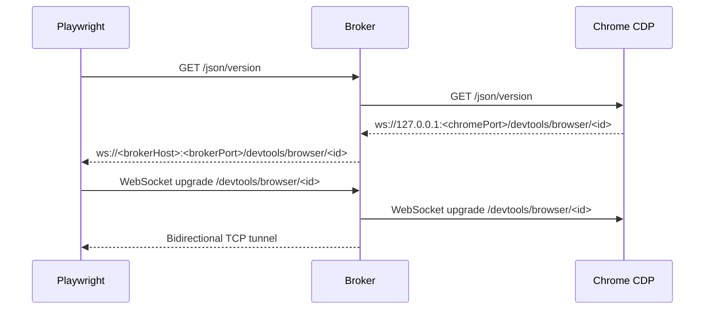

# Feature Spec: Chrome-Compatible CDP Broker

## 1. Background

Remote Playwright running on a code-server host needs to control a local visible
Chrome browser so an operator can complete MFA and monitor test execution.

## 2. Goals

- Let Playwright connect with `chromium.connectOverCDP('http://127.0.0.1:18080')`.
- Preserve Chrome-compatible discovery endpoints instead of introducing a custom endpoint.
- Rewrite Chrome debugger WebSocket URLs so clients connect through the broker.
- Tunnel CDP WebSocket upgrades to the actual local Chrome remote debugging port.

## 3. Non-goals

- Full Playwright browser-server protocol support.
- Browser automation logic inside the broker.
- App-level broker authentication in the initial implementation.

## 4. System Flow

## 5. Interfaces

| Interface | Request | Response | Notes |
|---|---|---|---|
| HTTP | `GET /json/version` | Chrome JSON with broker-rewritten `webSocketDebuggerUrl` | Main Playwright discovery path. |
| HTTP | `GET /json`, `GET /json/list` | Chrome target list with rewritten URLs | Compatible with DevTools list endpoints. |
| HTTP | `GET /healthz` | `{ ok: true, chrome: "host:port" }` | Operator readiness check. |
| WebSocket | `/devtools/browser/<id>` | Raw tunnel to Chrome | No message inspection. |
| WebSocket | `/devtools/page/<id>` | Raw tunnel to Chrome | No message inspection. |

## 6. Implementation Map

| Layer | Path | Responsibility |
|---|---|---|
| CLI | `src/cli.js` | Starts server after Chrome readiness. |
| Proxy | `src/server.js` | HTTP proxy, debugger URL rewrite, WebSocket upgrade tunnel. |
| Chrome | `src/chrome.js` | Chrome launch args and readiness polling. |

## 7. Tests

| Test | Path | Coverage | Gaps |
|---|---|---|---|
| Unit | `test/server.test.js` | Recursive debugger URL rewrite and `wss` behavior. | Does not start fake Chrome or tunnel WebSocket traffic. |

## 8. NFR Impact

- Security: CDP grants browser control; keep broker loopback or behind trusted tunnel.
- Reliability: URL rewrite correctness is essential for remote clients.
- Observability: HTTP proxy errors currently surface as `502` responses.
- Compatibility: CDP discovery shape matches Chrome endpoints used by Playwright.

## 9. Known Risks / Edge Cases

- Broker does not enforce authentication.
- WebSocket upgrade path is tunneled by raw TCP proxy and needs integration tests.
- If a reverse proxy changes `Host`, debugger URL rewriting follows the request host.

## 10. Sources

- Code: `../../../src/server.js`
- Code: `../../../src/cli.js`
- Code: `../../../src/chrome.js`
- Tests: `../../../test/server.test.js`
- Raw: `../../raw/codebase/APIs/http-route-map.md`
- Wiki: `../../wiki/architecture/system-overview.md`
