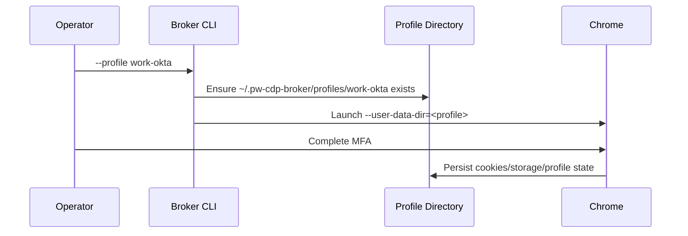

# Feature Spec: Persistent Browser Profiles

## 1. Background

MFA workflows require a visible local browser and benefit from persisted cookies,
local storage, and other Chrome profile state across broker runs.

## 2. Goals

- Provide safe named profiles for different accounts/apps.
- Map named profiles under broker-owned storage.
- Allow explicit `--user-data-dir` for advanced operators.
- Allow explicit profile reset when a clean login is needed.

## 3. Non-goals

- Syncing profile state to the remote code-server host.
- Exporting Playwright `storageState()` JSON.
- Protecting explicitly provided `--user-data-dir` paths from operator intent.

## 4. User Flow

## 5. Interfaces

| Option | Behavior |
|---|---|
| `--profile <name>` | Uses `~/.pw-cdp-broker/profiles/<name>`. |
| `--user-data-dir <path>` | Uses explicit path, mutually exclusive with `--profile`. |
| `--reset-profile` | Recursively deletes selected profile directory before launch. |

## 6. Business Rules

- Profile names may contain only letters, numbers, dot, underscore, and dash.
- `.` and `..` are rejected.
- `--profile` and `--user-data-dir` cannot be used together.
- Default profile name is `default`.

## 7. Implementation Map

| Layer | Path | Responsibility |
|---|---|---|
| Profile policy | `src/profiles.js` | Validation and path mapping. |
| CLI | `src/cli.js` | Option conflict check, reset, directory creation, Chrome launch. |
| Chrome | `src/chrome.js` | Adds `--user-data-dir=<path>` to Chrome args. |

## 8. Tests

| Test | Path | Coverage | Gaps |
|---|---|---|---|
| Unit | `test/profiles.test.js` | Safe names, rejected names, profile path mapping. | Does not test `--reset-profile` deletion. |

## 9. NFR Impact

- Security: profile directories contain sensitive auth state.
- Reliability: persistent profile enables repeated MFA-authenticated test runs.
- Maintainability: named profiles reduce accidental use of real daily Chrome profile.

## 10. Sources

- Code: `../../../src/profiles.js`
- Code: `../../../src/cli.js`
- Code: `../../../src/chrome.js`
- Tests: `../../../test/profiles.test.js`
- Raw: `../../raw/codebase/nfr/security-surface.md`
- Wiki: `../../wiki/nfr/security.md`
