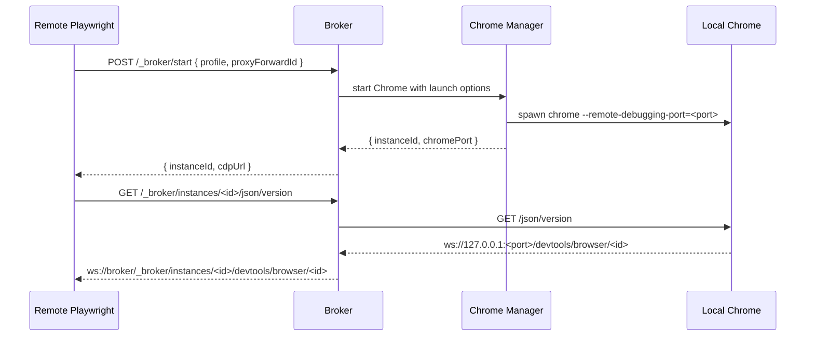

# Feature Spec: Remote Browser Lifecycle Control

## 1. Background

Remote Playwright sometimes needs to choose the Chrome profile, proxy, and TLS
behavior at test runtime. Those options are Chrome launch-time settings, so the
broker must be able to listen without Chrome and start a local browser only when
the remote side requests one.

## 2. Goals

- Support `--standby` so the broker listens without launching Chrome.
- Let remote clients start Chrome with a named profile and launch-time proxy/TLS options.
- Return an instance-scoped CDP URL that Playwright can pass to `connectOverCDP`.
- Support multiple concurrent Chrome instances when their profile directories differ.

## 3. Non-goals

- Replacing Playwright's CDP client.
- Runtime proxy switching inside an already-running Chrome process.
- Mandatory app-level authentication in localhost/SSH workflows.

## 4. System Flow

## 5. APIs / Interfaces

| Endpoint / Function | Request | Response | Notes |
|---|---|---|---|
| `POST /_broker/start` | JSON launch options | `{ ok, instanceId, cdpUrl, profile }` | Starts Chrome unless the requested profile directory is already active. |
| `GET /_broker/status` | none | `{ ok, running, instances, proxyForwards }` | Reports active instances and proxy-forward metadata. |
| `POST /_broker/stop` | `{ instanceId }` when multiple instances run | `{ ok, stopped }` | Stops the requested instance. |
| `POST /_broker/profiles/clear` | `{ profile }` | `{ ok, cleared, profile, userDataDir }` | Clears inactive broker-managed persistent profile data. |
| `GET /_broker/help` | none | Markdown | Returns remote Playwright usage instructions. |
| `GET /_broker/instances/<id>/json/version` | Chrome discovery | Chrome JSON with instance-scoped debugger URL | Playwright CDP discovery path. |
| `WS /_broker/instances/<id>/devtools/...` | WebSocket upgrade | Raw tunnel to Chrome | Routes by `instanceId`. |

## 6. Business Rules

- In standby mode, root CDP discovery returns `503` until Chrome is started.
- Root CDP discovery returns `409` when multiple instances are running.
- `profile` in `/_broker/start` is a validated named profile unless startup
  options already constrain the broker to an explicit `--user-data-dir`.
- A Chrome instance gets a random, high-entropy `instanceId`.
- The instance path is the routing handle for Playwright and lifecycle calls.
- A running Chrome instance cannot change proxy or TLS launch options; callers
  must stop/restart to change them.
- Multiple running instances must not share the same profile directory.
- Profile clear requests are limited to named broker-managed profiles and fail
  while an instance is using the target profile directory.

## 7. Implementation Map

| Layer | Path | Responsibility |
|---|---|---|
| CLI | `src/cli.js` | Parse `--standby`, create lifecycle manager, wire server and SSH. |
| Lifecycle | `src/browser-manager.js` | Start/stop Chrome, allocate debug ports, track instance metadata. |
| Proxy forwards | `src/proxy-forwards.js` | Manage SSH local forwards referenced by `proxyForwardId`. |
| Proxy | `src/server.js` | Serve control routes and route instance-scoped CDP traffic. |
| Chrome | `src/chrome.js` | Build Chrome launch args and readiness polling. |
| Profiles | `src/profiles.js` | Validate named profiles and map them to user data dirs. |

## 8. Tests

| Test | Path | Coverage | Gaps |
|---|---|---|---|
| Unit | `test/browser-manager.test.js` | Start validation, multi-instance profile isolation, launch args, stop behavior. | Does not launch real Chrome. |
| Unit | `test/server.test.js` | Control route responses, instance URL rewriting, proxy-forward resolution. | WebSocket tunneling still lacks integration coverage. |
| Unit | `test/proxy-forwards.test.js` | Managed proxy-forward create/list/delete behavior. | Does not open a real SSH connection. |
| Unit | `test/cli.test.js` | `--standby` parsing and existing proxy/SSH args. | Does not run CLI end to end. |

## 9. NFR Impact

- Security: unauthenticated control endpoints can start and stop local Chrome;
  keep loopback/SSH-only by default and retain optional token support later.
- Reliability: stale instance IDs should return `404` instead of routing to the wrong Chrome.
- Observability: status route exposes active instance metadata without secrets.
- Compatibility: returned `cdpUrl` remains valid input for Playwright
  `chromium.connectOverCDP(...)`.

## 10. Sources

- Code: `../../../src/cli.js`
- Code: `../../../src/server.js`
- Code: `../../../src/proxy-forwards.js`
- Code: `../../../src/chrome.js`
- Code: `../../../src/profiles.js`
- Tests: `../../../test/server.test.js`
- Tests: `../../../test/proxy-forwards.test.js`
- Tests: `../../../test/cli.test.js`
- Wiki: `../../wiki/architecture/system-overview.md`
