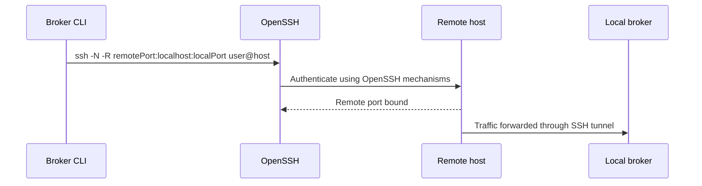

# Integration Spec: SSH Reverse Tunnel

## 1. Background

The remote code-server host often cannot directly reach an operator laptop.
An SSH reverse tunnel maps a remote loopback port back to the local broker port.

## 2. Goals

- Let the broker optionally start native OpenSSH tunnel mode.
- Reuse OpenSSH authentication for 24 hours via `ControlPersist=24h`.
- Avoid reading, storing, or caching SSH passwords in broker code.

## 3. Non-goals

- Implementing SSH protocol in Node.
- Storing SSH passwords.
- Managing server-side SSH configuration.

## 4. System Flow



## 5. Interface

| Option | Behavior |
|---|---|
| `--ssh <user@host>` | Starts native `ssh`. |
| `--ssh-remote-port <port>` | Remote listening port, default same as broker port. |
| `--ssh-control-persist <time>` | OpenSSH ControlPersist value, default `24h`. |

The spawned SSH command includes:

```text
-o ControlMaster=auto
-o ControlPersist=<time>
-o ControlPath=$HOME/.pw-cdp-broker/ssh/%C
-N
-R <remotePort>:localhost:<localPort>
```

## 6. Implementation Map

| Layer | Path | Responsibility |
|---|---|---|
| CLI | `src/cli.js` | Builds SSH args and spawns `ssh` with inherited stdio. |
| Docs | `README.md` | Documents manual and broker-managed tunnel usage. |

## 7. Tests

| Test | Path | Coverage | Gaps |
|---|---|---|---|
| None | N/A | No automated SSH test yet. | Add argument-construction test before changing tunnel behavior. |

## 8. NFR Impact

- Security: password prompts are OpenSSH-owned; broker does not handle secrets.
- Reliability: tunnel process exit is logged, but not auto-restarted.
- Observability: CLI prints target and port mapping.

## 9. Sources

- Code: `../../../src/cli.js`
- Docs: `../../../README.md`
- Raw: `../../raw/codebase/configs/env-config-inventory.md`
- Wiki: `../../wiki/operations/build-and-runtime.md`
