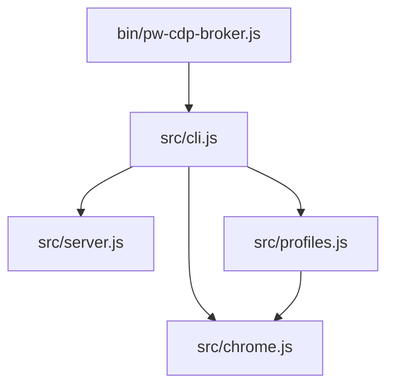

# Module Boundaries

## What this page explains

This page documents the major modules and the intended ownership boundaries.

## Summary

The codebase is intentionally small and dependency-free. `src/cli.js` owns
process lifecycle and command-line behavior. `src/server.js` owns CDP proxy
behavior and has no knowledge of Chrome process launch or SSH. `src/chrome.js`
owns Chrome-specific executable, argument, port, and readiness helpers.
`src/profiles.js` owns profile name validation and profile path mapping.

## Dependency Map

## Important Code Paths

| Path | Boundary | Stable Responsibility |
|---|---|---|
| `bin/pw-cdp-broker.js` | Entrypoint | Execute CLI and convert uncaught errors to process failures. |
| `src/cli.js` | Application orchestration | Configure and connect Chrome, broker server, and optional SSH tunnel. |
| `src/server.js` | Protocol proxy | Preserve Chrome-compatible CDP surface. |
| `src/chrome.js` | Browser runtime | Produce Chrome launch args and detect readiness. |
| `src/profiles.js` | Profile path policy | Keep named profiles inside broker-owned storage. |

## Related Feature Specs

- [Chrome-Compatible CDP Broker](../../fs/features/chrome-compatible-cdp-broker.md)
- [Persistent Browser Profiles](../../fs/features/persistent-browser-profiles.md)

## Sources

- Raw: `../../raw/codebase/modules/module-inventory.md`
- Raw: `../../raw/codebase/dependencies/import-graph.mmd`
- Code: `../../../bin/pw-cdp-broker.js`
- Code: `../../../src/cli.js`
- Code: `../../../src/server.js`
- Code: `../../../src/chrome.js`
- Code: `../../../src/profiles.js`
