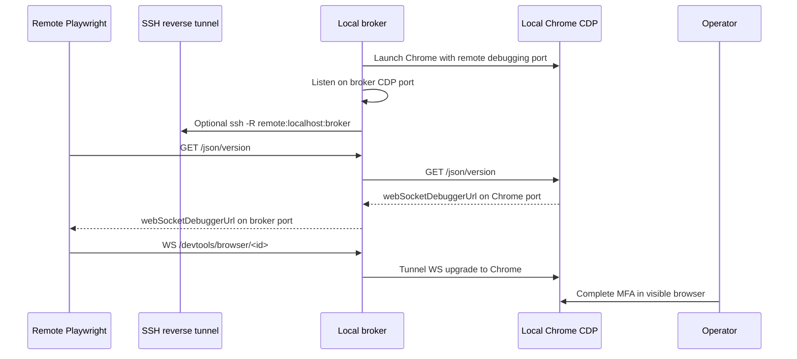
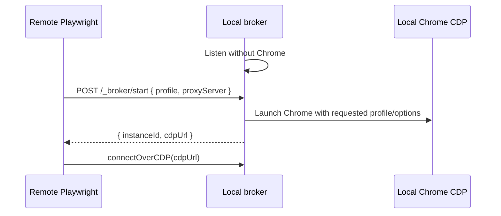

# System Overview

## What this page explains

This page explains how `pw-cdp-broker` lets remote Playwright control a local
visible Chrome session for MFA and test monitoring workflows.

## Summary

`pw-cdp-broker` is a local Node.js CLI. It can launch Chrome immediately with a
persistent user data directory and a private remote debugging port, or run in
standby mode and wait for a remote `/_broker/start` request that supplies the
profile and launch-time proxy/TLS options. Remote Playwright connects to the
broker with `chromium.connectOverCDP(...)`. The broker proxies HTTP discovery to
Chrome, rewrites debugger WebSocket URLs to point back at the broker, and
tunnels WebSocket upgrade traffic to Chrome.

When direct remote-to-local networking is unavailable, the CLI can spawn an
OpenSSH reverse tunnel with `ControlPersist=24h`. SSH authentication remains
owned by OpenSSH.

## Architecture / Flow

In standby mode, the first step is deferred:

## Important Code Paths

| Path | Role | Notes |
|---|---|---|
| `src/cli.js` | Runtime orchestration | Parses CLI options, launches Chrome, starts broker, optionally starts SSH. |
| `src/server.js` | CDP proxy | Rewrites discovery JSON and tunnels WebSocket upgrades. |
| `src/browser-manager.js` | Browser lifecycle | Starts/stops broker-owned Chrome instances and tracks instance metadata. |
| `src/chrome.js` | Chrome process support | Builds launch args, finds Chrome, waits for CDP readiness. |
| `src/profiles.js` | Profile policy | Maps safe profile names to persistent profile directories. |

## Related Feature Specs

- [Chrome-Compatible CDP Broker](../../fs/features/chrome-compatible-cdp-broker.md)
- [Persistent Browser Profiles](../../fs/features/persistent-browser-profiles.md)
- [Remote Browser Lifecycle Control](../../fs/features/remote-browser-lifecycle-control.md)
- [SSH Reverse Tunnel Integration](../../fs/integrations/ssh-reverse-tunnel.md)

## Related Tests

- `test/server.test.js`
- `test/browser-manager.test.js`
- `test/cli.test.js`
- `test/profiles.test.js`

## NFR Notes

- Security: any client reaching the broker can control the browser; default bind is loopback.
- Reliability: Chrome readiness is polled before the broker starts listening.
- Observability: launch and child process lifecycle messages are printed to the terminal.

## Sources

- Code: `../../../src/cli.js`
- Code: `../../../src/server.js`
- Code: `../../../src/browser-manager.js`
- Code: `../../../src/chrome.js`
- Code: `../../../src/profiles.js`
- Raw: `../../raw/codebase/modules/module-inventory.md`
- Raw: `../../raw/codebase/APIs/http-route-map.md`
- Tests: `../../../test/server.test.js`
- Tests: `../../../test/profiles.test.js`
