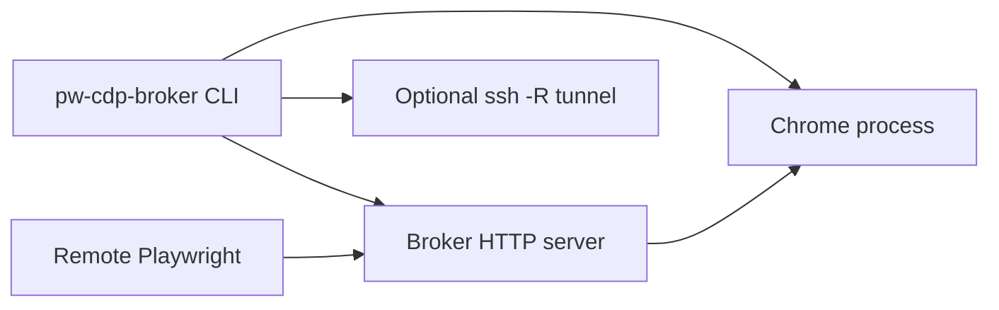

# Build And Runtime

## What this page explains

This page explains how the project is run, tested, and connected to a remote
Playwright process.

## Summary

The project has no build step and no npm dependencies. It runs directly on Node
18+ as ES modules. The main runtime dependency is a Chrome/Chromium-compatible
browser executable. SSH is optional and only used when `--ssh` is provided.

## Operator Commands

| Command | Purpose |
|---|---|
| `npm start -- --profile work-okta` | Start local broker with named persistent profile. |
| `node bin/pw-cdp-broker.js --profile work-okta --ssh user@code-server` | Start broker and OpenSSH reverse tunnel. |
| `npm test` | Run Node built-in unit tests. |

## Runtime Topology

## Sources

- Code: `../../../package.json`
- Code: `../../../src/cli.js`
- Code: `../../../src/chrome.js`
- Raw: `../../raw/codebase/build-runtime/runtime-inventory.md`
- Docs: `../../../README.md`
